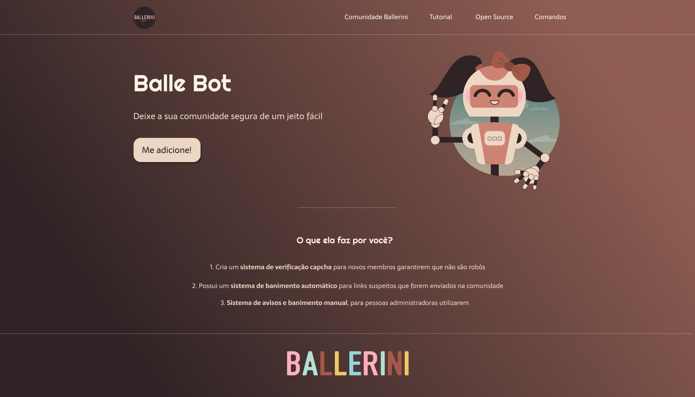

<h1 align="center"> LANDING PAGE </h1>

Layout desse landing page feito pela Rafaella Ballerini.

  <a href="#-tecnologias">Tecnologias</a>&nbsp;&nbsp;&nbsp;|&nbsp;&nbsp;&nbsp;
  <a href="#-projeto">Projeto</a>&nbsp;&nbsp;&nbsp;|&nbsp;&nbsp;&nbsp;
  <a href="#-layout">Layout</a>&nbsp;&nbsp;&nbsp;|&nbsp;&nbsp;&nbsp;
  <a href="#memo-licença">Licença</a>

  

 

  

## 🚀 Tecnologias

Esse projeto foi desenvolvido com as seguintes tecnologias:

- HTML e CSS

## 💻 Projeto

Para treinar meus conhecimentos de HTML e CSS fiz essa landing page tentando fazer o máximo possível sem acompanhar a vídeo aula. 

## 🔖 Layout

Você pode visualizar o layout do projeto através [DESSE LINK](https://www.figma.com/file/myqP66iQwzjwjrIAJyyrip/BalleBot?node-id=2%3A2&t=TnAGhrvR9QZueewI-0). É necessário ter conta no [Figma](https://figma.com) para acessá-lo.

Você também pode visualizar a vídeo aular atráves [DESSE LINK](https://www.youtube.com/watch?v=llF6vD-RljE&t=719s&ab_channel=RafaellaBallerini).

## :memo: Licença

Esse projeto está sob a licença MIT.
